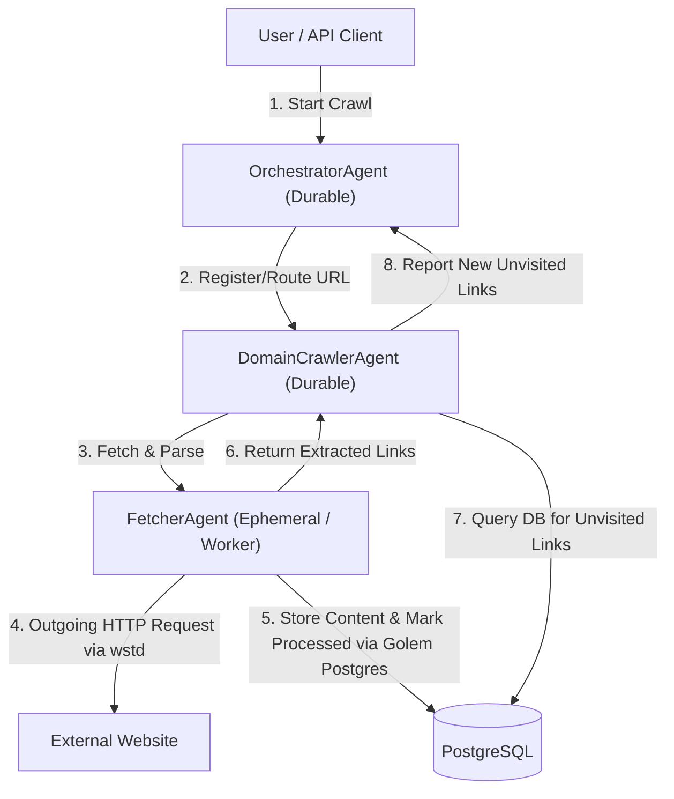

# Golem-based Web Crawler Architecture Proposal (Rust)

A distributed, durable, and highly scalable web crawler designed to leverage **Golem Cloud's core features**:
*   **Durable Execution**: Automatic resumption of crawls if host nodes restart, with no lost progress.
*   **Sequential Invocation**: Natural concurrency control per-agent, making rate-limiting and politeness constraints trivial to enforce without distributed locks.
*   **Durable Retries**: Transparent retry mechanisms for transient HTTP fetch failures.
*   **Stateless Offloading**: Ephemeral worker agents for memory-heavy HTTP fetching and HTML parsing to minimize Golem's persistent storage overhead.

---

## High-Level Architecture Diagram



---

## Technical Stack Selection

### 1. HTTP Client: `wstd::http`
*   **Implementation**: Utilizes `wstd::http::Client` which compiles to `wasm32-wasip2` and utilizes WASI-HTTP directly.
*   **Alternative**: `golem-wasi-http` for reqwest-like builder APIs if complex multipart/form capabilities are needed.
*   **Benefits**: Built-in support, no native OS dependencies, works perfectly with Golem's durable retry policies.

### 2. Database Integration: Golem RDBMS (`PostgreSQL`)
*   **Library**: `golem_rust::bindings::golem::rdbms::postgres` (built-in Golem Host API).
*   **Implementation**: Workers insert parsed results and update crawled state using transactional SQL commands.
*   **Benefits**: Offloads the crawled page state from Golem's metadata logs to a dedicated PostgreSQL database, keeping the agent memory footprints tiny and bounded.

---

## Recommended Database Schema & Migrations

To enable fast deduplication and keep Golem agent state lightweight, we separate the crawl queue tracking from the crawled page output.

The migration script containing the DDL definitions is located at:
*   [V1__Create_Crawler_Tables.sql](migrations/V1__Create_Crawler_Tables.sql)

### 1. `crawl_frontier` Table
Tracks queue state, status, priority, and crawl depth. Indexed by `url_hash` for $O(1)$ deduplication.

```sql
CREATE TABLE crawl_frontier (
    -- SHA-256 hash of URL for O(1) deduplication check
    url_hash VARCHAR(64) PRIMARY KEY, 
    url TEXT NOT NULL,
    domain VARCHAR(255) NOT NULL,
    
    -- Status: 'PENDING', 'IN_PROGRESS', 'COMPLETED', 'FAILED'
    status VARCHAR(20) NOT NULL DEFAULT 'PENDING',
    
    -- Priority: Higher values are crawled first
    priority INT NOT NULL DEFAULT 0,
    depth INT NOT NULL DEFAULT 0,
    
    discovered_at TIMESTAMP WITH TIME ZONE DEFAULT CURRENT_TIMESTAMP,
    crawled_at TIMESTAMP WITH TIME ZONE,
    error_message TEXT
);

-- Index for DomainCrawlerAgent to load high-priority pending URLs quickly
CREATE INDEX idx_frontier_domain_status_priority 
ON crawl_frontier(domain, status, priority DESC, discovered_at ASC);
```

### 2. `page_contents` Table
Stores raw crawled HTML and parsed text, decoupled from the lightweight queue table.

```sql
CREATE TABLE page_contents (
    url_hash VARCHAR(64) PRIMARY KEY REFERENCES crawl_frontier(url_hash) ON DELETE CASCADE,
    title VARCHAR(512),
    http_status INT,
    raw_html TEXT,
    extracted_text TEXT,
    saved_at TIMESTAMP WITH TIME ZONE DEFAULT CURRENT_TIMESTAMP
);
```

---

## Agent-Specific Error Models

By creating separate, scoped error schemas, each agent exposes a minimal API and keeps its error domains clean.

```rust
use golem_rust::Schema;
use serde::{Deserialize, Serialize};

// Orchestrator-specific errors
#[derive(Clone, Debug, Schema, Serialize, Deserialize)]
pub enum OrchestratorError {
    EmptySeedList,
    CrawlJobAlreadyActive { job_id: String },
    InvalidDomainRegistered { domain: String },
    OrchestratorDBFailure { message: String },
}

// DomainCrawler-specific errors
#[derive(Clone, Debug, Schema, Serialize, Deserialize)]
pub enum DomainCrawlerError {
    QueueFull { max_size: usize },
    InvalidUrlForDomain { url: String, domain: String },
    ConfigurationError { message: String },
}

// Fetcher-specific errors
#[derive(Clone, Debug, Schema, Serialize, Deserialize)]
pub enum FetcherError {
    InvalidUrl { url: String, reason: String },
    RobotsDisallowed { url: String },
    HttpFetchFailed { url: String, status_code: u16, message: String },
    PostgresWriteFailed { message: String },
}
```

---

## Agent Designs & REST API Endpoints

Using Golem HTTP annotations (`#[agent_definition]`, `#[endpoint]`), we expose control loops over HTTP using the agent-specific error types.

### 1. `OrchestratorAgent` (Durable)
Exposed at `/crawlers/{crawl_job_id}`.

```rust
use golem_rust::{agent_definition, endpoint, Schema};
use serde::{Deserialize, Serialize};

#[derive(Clone, Debug, Schema, Serialize, Deserialize)]
pub struct CrawlStatus {
    pub job_id: String,
    pub active_domains: Vec<String>,
    pub total_domains_crawl_count: u32,
}

#[agent_definition(mount = "/crawlers/{crawl_job_id}")]
pub trait OrchestratorAgent {
    // The constructor defines the agent identity based on crawl_job_id
    fn new(crawl_job_id: String) -> Self;

    // Start a crawl session.
    #[endpoint(post = "/start")]
    async fn start_crawl(&mut self, seeds: Vec<String>) -> Result<(), OrchestratorError>;

    // Get current crawl session statistics.
    #[endpoint(get = "/status")]
    async fn get_status(&self) -> Result<CrawlStatus, OrchestratorError>;

    // Add new URLs discovered during the crawl (internal RPC)
    async fn add_urls(&mut self, urls: Vec<String>) -> Result<(), OrchestratorError>;
}
```

### 2. `DomainCrawlerAgent` (Durable)
Exposed at `/domains/{domain_name}`.

```rust
#[derive(Clone, Debug, Schema, Serialize, Deserialize)]
pub struct PrioritizedUrl {
    pub url: String,
    pub priority: i32,
}

#[derive(Clone, Debug, Schema, Serialize, Deserialize)]
pub struct DomainState {
    pub domain: String,
    pub politeness_delay_ms: u32,
    pub pending_queue: Vec<PrioritizedUrl>, // Sorted by priority DESC, discovered_at ASC
    pub in_progress_count: u32,
}

#[agent_definition(mount = "/domains/{domain_name}")]
pub trait DomainCrawlerAgent {
    fn new(domain_name: String) -> Self;

    // Enqueue new unvisited URLs found under this domain
    async fn enqueue(&mut self, urls: Vec<PrioritizedUrl>) -> Result<(), DomainCrawlerError>;

    // Retrieve current in-memory queue status
    #[endpoint(get = "/state")]
    async fn get_state(&self) -> Result<DomainState, DomainCrawlerError>;

    // Adjust politeness delay dynamically via REST
    #[endpoint(post = "/config/delay")]
    async fn set_delay(&mut self, delay_ms: u32) -> Result<(), DomainCrawlerError>;
}
```

### 3. `FetcherAgent` (Ephemeral / Stateless Worker)
Not exposed over HTTP. It acts as an internal worker agent invoked via RPC by `DomainCrawlerAgent`.

```rust
#[derive(Clone, Debug, Schema, Serialize, Deserialize)]
pub struct FetchResult {
    pub url: String,
    pub title: String,
    pub extracted_links: Vec<PrioritizedUrl>,
    pub status: u16,
}

#[agent_definition(ephemeral)]
pub trait FetcherAgent {
    fn new(worker_id: String) -> Self;

    // Fetch the page using wstd::http and persist results to PostgreSQL
    async fn fetch_and_parse(&self, url: String) -> Result<FetchResult, FetcherError>;
}
```

---

## Data Flow & State Management Strategy

To ensure memory remains bounded even when crawling millions of pages:

1. **Start**: `DomainCrawlerAgent` pops the next URL from `pending_queue` and increments `in_progress_count`.
2. **Execute**: It invokes the `FetcherAgent` with the URL.
3. **Fetch (`wstd::http`)**: `FetcherAgent` fetches the page content using WASI HTTP.
4. **Persist (Postgres)**: `FetcherAgent` inserts the content to PostgreSQL, marks the URL as **Processed** in the database, and returns all extracted hyperlinks (with assigned priorities).
5. **Clean up**: `DomainCrawlerAgent` receives the links and decrements `in_progress_count`.
6. **Deduplicate**: `DomainCrawlerAgent` queries PostgreSQL to filter out already-processed URLs.
7. **Queue**: The remaining new prioritized URLs are merged into the `pending_queue` sorted by priority DESC (up to its maximum capacity limit).
