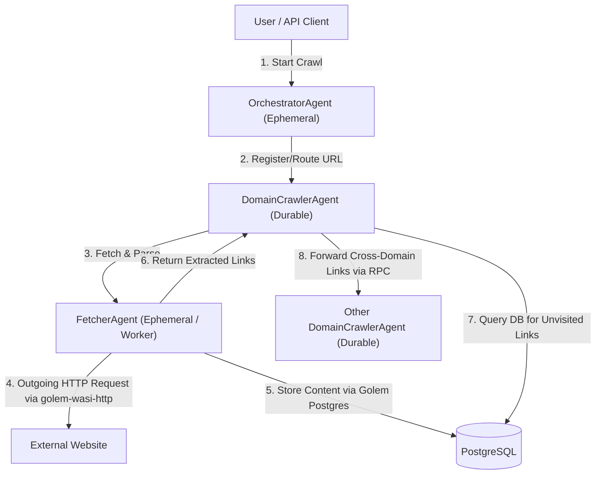

# Golem-based Web Crawler Architecture Proposal (Rust)

A distributed, durable, and highly scalable web crawler designed to leverage **Golem Cloud's core features**:
*   **Durable Execution**: Automatic resumption of crawls if host nodes restart, with no lost progress.
*   **Sequential Invocation**: Natural concurrency control per-agent, making rate-limiting and politeness constraints trivial to enforce without distributed locks.
*   **Durable Retries**: Transparent retry mechanisms for transient HTTP fetch failures.
*   **Stateless Offloading**: Ephemeral worker agents for memory-heavy HTTP fetching and HTML parsing to minimize Golem's persistent storage overhead.

---

## High-Level Architecture Diagram



---

## Technical Stack Selection

### 1. HTTP Client: `golem-wasi-http`
*   **Implementation**: Uses the `golem-wasi-http` client library (with `async` and `json` features enabled).
*   **Benefits**: Reqwest-like builder APIs (`.get()`, `.post()`, `.bearer_auth()`, `.query()`, `.error_for_status()`) targeting WASI-HTTP. It integrates natively with Golem's durable retry policies.

### 2. Database Integration: Golem RDBMS (`PostgreSQL`)
*   **Library**: `golem_rust::bindings::golem::rdbms::postgres` (built-in Golem Host API).
*   **Implementation**: Workers insert parsed results and update crawled state using transactional SQL commands.
*   **Benefits**: Offloads the crawled page state from Golem's metadata logs to a dedicated PostgreSQL database, keeping the agent memory footprints tiny and bounded.

---

## Recommended Database Schema & Migrations

The database stores crawled page content and results. Since `DomainCrawlerAgent` is a durable agent, it maintains the queue of pending URLs in its persistent memory, eliminating the need for a separate queue table in the database.

The migration script containing the DDL definitions is located at:
*   [V1__Create_Crawler_Tables.sql](migrations/V1__Create_Crawler_Tables.sql)

### `page_contents` Table
Stores raw crawled HTML, title, HTTP status, and parsed text. The `url` is used directly as the primary key.

```sql
CREATE TABLE page_contents (
    url TEXT PRIMARY KEY,
    title VARCHAR(512),
    http_status INT,
    raw_html TEXT,
    extracted_text TEXT,
    saved_at TIMESTAMP WITH TIME ZONE DEFAULT CURRENT_TIMESTAMP
);
```

---

## Modular Component and Agent Design

Each agent is placed in its own dedicated Rust module along with its related schemas and error types. Shared data models (such as `PrioritizedUrl`) are maintained in a shared/common scope.

### Configuration for Database Access

To make each database‑accessing agent configurable we introduce a typed configuration struct that includes a `db: PostgresDbConfig` field. The structs derive `ConfigSchema` so they are automatically exposed in the Golem manifest.

```rust
// src/orchestrator.rs
#[derive(ConfigSchema, Clone, Debug, Serialize, Deserialize)]
pub struct OrchestratorConfig {
    // Database connection details used by the orchestrator
    pub db: PostgresDbConfig,
    // (optional) future fields such as concurrency limits can be added here
}

// src/fetcher.rs
#[derive(ConfigSchema, Clone, Debug, Serialize, Deserialize)]
pub struct FetcherConfig {
    pub db: PostgresDbConfig,
}

// src/domain_crawler.rs
use crate::common::PrioritizedUrl;
use crate::common_lib::database::PostgresDbConfig;
use golem_rust::{ConfigSchema, Schema, agent_definition, agentic::Config, endpoint};
use serde::{Deserialize, Serialize};

#[derive(ConfigSchema)]
pub struct DomainCrawlerConfig {
    #[config_schema(nested)]
    pub url_processing: UrlProcessingConfig,
}

#[derive(ConfigSchema)]
pub struct UrlProcessingConfig {
    #[config_schema(secret)]
    pub boost_words: Secret<Vec<String>>,
    #[config_schema(secret)]
    pub max_url_length: Secret<u32>,
}

#[derive(Clone, Debug, Schema, Serialize, Deserialize)]
pub struct DomainState {
    pub domain: String,
    pub politeness_delay_ms: u32,
    pub pending_queue: Vec<PrioritizedUrl>,
    pub status: ProcessingStatus,
    pub robots_disallowed: Option<Vec<String>>,
}
```

### How the config is passed to agents

Each agent’s constructor now takes a `#[agent_config] Config<…>` parameter:

```rust
// Example for OrchestratorAgent
fn new(#[agent_config] config: Config<OrchestratorConfig>) -> Self;
```

The implementation stores the `Config` value inside the agent struct and uses it when creating a `DatabaseHelper`:

```rust
let db_cfg = self.config.get().db;
let db = DatabaseHelper::from(db_cfg)?;
```

### Manifest updates (`golem.yaml`)

Add the configuration under each agent’s `config` section:

```yaml
agents:
  OrchestratorAgent:
    config:
      db:
        host: "{{ POSTGRES_HOST }}"
        db: "{{ POSTGRES_DB }}"
        port: "{{ POSTGRES_PORT }}"
  FetcherAgent:
    config:
      db: *same-as-above
  DomainCrawlerAgent:
    config:
      db: *same-as-above
secretDefaults:
  local:
    db:
      user: "{{ POSTGRES_USER }}"
      password: "{{ POSTGRES_PASSWORD }}"
```

These changes enable each agent to obtain its own database credentials and simplify testing and deployment across environments.

---
Contains `OrchestratorAgent` and its error types.

```rust
use golem_rust::{agent_definition, endpoint, Schema};
use serde::{Deserialize, Serialize};

#[derive(Clone, Debug, Schema, Serialize, Deserialize)]
pub enum OrchestratorError {
    EmptySeedList,
    InvalidUrl { url: String },
    DatabaseError { message: String },
}

#[agent_definition(ephemeral, mount = "/crawler")]
pub trait OrchestratorAgent {
    fn new(#[agent_config] config: Config<OrchestratorConfig>) -> Self;

    // Start a crawl session
    #[endpoint(post = "/start")]
    async fn start_crawl(&self, seeds: Vec<String>) -> Result<(), OrchestratorError>;

    // Get all unique crawled domains from database
    #[endpoint(get = "/domains")]
    async fn get_domains(&self) -> Result<Vec<String>, OrchestratorError>;
}
```

### 2. `src/domain_crawler.rs`
Contains `DomainCrawlerAgent`, its configuration state, and errors.

```rust
use golem_rust::{agent_definition, endpoint, Schema};
use serde::{Deserialize, Serialize};

// Shared model for referencing a URL and its queue priority
#[derive(Clone, Debug, Schema, Serialize, Deserialize)]
pub struct PrioritizedUrl {
    pub url: String,
    pub priority: i32,
}

#[derive(Clone, Debug, Schema, Serialize, Deserialize)]
pub enum DomainCrawlerError {
    QueueFull { max_size: usize },
    InvalidUrlForDomain { url: String, domain: String },
    ConfigurationError { message: String },
}

#[derive(Clone, Debug, Schema, Serialize, Deserialize)]
pub struct DomainState {
    pub domain: String,
    pub politeness_delay_ms: u32,
    pub pending_queue: Vec<PrioritizedUrl>, // Sorted by priority DESC
    pub status: ProcessingStatus,
    pub robots_disallowed: Option<Vec<String>>, // None means not fetched yet
}

#[agent_definition(mount = "/domains/{domain_name}")]
pub trait DomainCrawlerAgent {
    // Constructor parameter identifies the Domain Crawler agent instance
    fn new(domain_name: String, #[agent_config] config: Config<DomainCrawlerConfig>) -> Self;

    // Enqueue new unvisited URLs found under this domain
    async fn enqueue(&mut self, urls: Vec<PrioritizedUrl>) -> Result<(), DomainCrawlerError>;

    // Retrieve current in-memory queue status
    #[endpoint(get = "/state")]
    async fn get_state(&self) -> Result<DomainState, DomainCrawlerError>;

    // Adjust politeness delay dynamically via REST
    #[endpoint(post = "/config/delay")]
    async fn set_delay(&mut self, delay_ms: u32) -> Result<(), DomainCrawlerError>;
}
```

### 3. `src/fetcher.rs`
Contains the stateless `FetcherAgent` worker using `golem-wasi-http` for outgoing HTTP requests.

```rust
use golem_rust::{agent_definition, Schema};
use serde::{Deserialize, Serialize};
use crate::domain_crawler::PrioritizedUrl;

#[derive(Clone, Debug, Schema, Serialize, Deserialize)]
pub enum FetcherError {
    InvalidUrl { url: String, reason: String },
    RobotsDisallowed { url: String },
    HttpFetchFailed { url: String, status_code: u16, message: String },
    PostgresWriteFailed { message: String },
}

#[derive(Clone, Debug, Schema, Serialize, Deserialize)]
pub struct FetchResult {
    pub url: String,
    pub title: String,
    pub extracted_links: Vec<PrioritizedUrl>,
    pub status: u16,
}

#[agent_definition(ephemeral)]
pub trait FetcherAgent {
    // Constructor parameter identifies the fetcher worker instance
    fn new(#[agent_config] config: Config<FetcherConfig>) -> Self;

    // Fetch the page using golem-wasi-http and persist results to PostgreSQL
    async fn fetch_and_parse(&self, url: String) -> Result<FetchResult, FetcherError>;
}
```

---

## Data Flow & State Management Strategy

To ensure memory remains bounded even when crawling millions of pages:

1. **Start**: `DomainCrawlerAgent` pops the next URL from `pending_queue` and increments `in_progress_count`.
2. **Execute**: It invokes the `FetcherAgent` with the URL.
3. **Fetch (`golem-wasi-http`)**: `FetcherAgent` fetches the page content using `golem-wasi-http::Client`.
4. **Persist (Postgres)**: `FetcherAgent` performs an UPSERT to insert or update the crawled content in the `page_contents` table in the database, and returns all extracted hyperlinks (with assigned priorities).
5. **Clean up**: `DomainCrawlerAgent` receives the links and decrements `in_progress_count`.
6. **Deduplicate**: `DomainCrawlerAgent` queries PostgreSQL to filter out already-processed URLs.
7. **Queue**: The remaining new prioritized URLs are merged into the `pending_queue` sorted by priority DESC (up to its maximum capacity limit).

